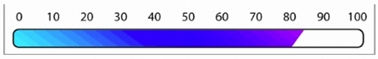

# SpeedometerCountdown
Displays an animated timer countdown like an automobile's analog speedometer.

An image is worth 1024 words:

Adjust the images to get different looks.

Class includes parameters to

* Change animation duration
* Set pointer image in front of main image
* Start animation
* Reset pointer position